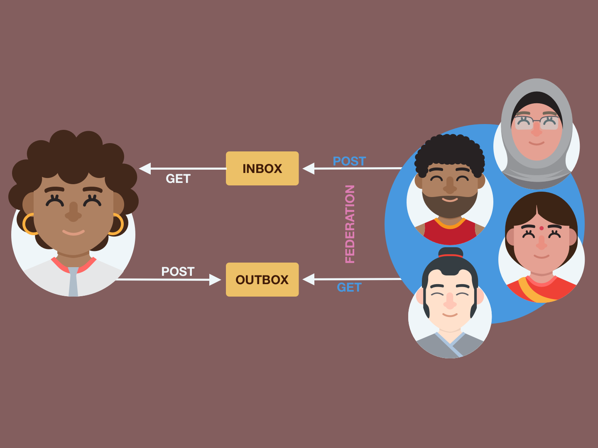

Federation Safety Enahncement Project by [Ro](https://roiskinda.cool/) <a href="https://ubiqueros.com/@Are0h"><i class="fa-brands fa-mastodon"></i></a>

**Table of Contents**

- [Context and Summary](#context-and-summary)
- [Challenge](#challenge)
- [Functional Requirements](#functional-requirements)
  - [Service Feature Integration](#service-feature-integration)
  - [Onboarding](#onboarding)
  - [Deny List Management](#deny-list-management)
  - [Moderation Data](#moderation-data)
- [Non-Functional Requirements](#non-functional-requirements)
- [Design](#design)
  - [Onboarding UI](#onboarding-ui)
  - [Blocklist UI](#blocklist-ui)
  - [Following UI Integration](#following-ui-integration)
- [Conclusion](#conclusion)
- [More information](#more-information)
    - [How to make changes](#how-to-make-changes)

## Context and Summary

As collective dissatisfaction with centralized social media grows with how they encourage people’s worst impulses to monetize them for the benefit of a few,  decentralized options are getting more attention now than ever before. 

The idea of decentralized platforms has marched into the collective consciousness of internet users globally. Adopting Activity Pub as a standard protocol has enabled online communities to create spaces tailored to their unique needs. 

However, with these new opportunities come new challenges. One of these new challenges is moderation. Though moderation was flawed on centralized platforms, there was at least a cursory attempt to curtail poor behavior by a team dedicated to these efforts. 

The decentralized nature of platforms such as Misskey, Akkoma, Mastodon, etc.,  makes this a particularly challenging topic because there needs to be a  consensus about what constitutes quality moderation, as every site is responsible for itself. 

This document proposes a solution to this challenge that will attempt to normalize moderation standards to increase safety and lessen the impact of poor behavior in the federated network. 

## Challenge 
The Fediverse is [defined](https://en.wikipedia.org/wiki/Fediverse) as (a portmanteau of "federation" and "universe"), an ensemble of federated (i.e., interconnected) servers that are used for web publishing (i.e., social networking, microblogging, blogging, or websites) and file hosting, which, while independently hosted, can communicate with each other. 

There have been several protocols that have been used to achieve federation between servers. This document will focus on [Activity Pub](https://www.w3.org/TR/activitypub/#social-web-working-group), an officially W3C-recognized standard based on the Activity Streams 2.0 format.  

The rise of the Activity Pub protocol has spawned several independent projects capable of speaking to each other, i.e., Misskey, Mastodon, Funkwhale, and  PeerTube, to name a few. 

This has enabled an exciting new chapter of social media networking where individuals can band together to create dynamic online experiences that are not subject to the changing [whims](https://mashable.com/article/vine-shut-down) of centralized services. 

However, with these new opportunities comes new challenges. One of the most extended ongoing challenges in centralized and decentralized spaces has been moderation: normalizing a standard of behavior that encourages healthy engagement. 

While the history of moderation in centralized places such as [Twitter](https://www.nbcnews.com/tech/tech-news/twitters-racist-algorithm-also-ageist-ableist-islamaphobic-researchers-rcna1632) and  [Instagram](https://www.bbc.com/news/technology-53498685) has been rocky, there were [resources](https://help.twitter.com/en/using-twitter/report-content) dedicated to wrestling with the complexities of this issue over time. 

The decentralized space has wiped this slate clean. And while the openness of the fediverse is a massive step forward in independent networks becoming an everyday experience on the web, the downside is that many of these spaces have become unregulated with little to no moderation at all. 

These unregulated [spaces](https://theconversation.com/citizens-social-media-like-mastodon-can-provide-an-antidote-to-propaganda-and-disinformation-192491) attract hateful and aggressive people looking to shake off the restrictions by centralized platforms to let their bigotry fly without fear of consequences as the larger fediverse looks to find its feet. And unfortunately, this lack of attention can result in [monocultures](https://techpolicy.press/the-whiteness-of-mastodon/) that can have (content warning -  violence) [devastating](https://www.wired.com/story/pittsburgh-synagogue-shooting-gab-tree-of-life/) consequences. 

One convention that federated platforms have adopted to combat harassment and abuse has been blocklists, which enable sites to refuse to federate with any  URL deemed a threat to said site. The now-defunct [Block Together](https://blocktogether.org/) used a similar methodology to enhance safety and abuse mitigation on Twitter.  

The obvious issue is that every site can have its blocklists, which is excellent for individual setups. However, this makes collaboration between these lists challenging, which can hamper coordination around dealing with abusive sites that perpetually engage in harassment and bad faith engagement. 

To prioritize this [collaboration](https://codeberg.org/oliphant/blocklists) and make it easier to defederate with sites with a  history of poor behavior, The Bad Space was created, a searchable database populated with sites that multiple instances have blocked. While still in alpha, this site provides new opportunities to enhance safety and abuse mitigation and improve onboarding and blocklist maintenance by providing an easy way to keep blocklists up to date from a central location through dynamically created export lists and public API that can be used to search the database programmatically.

These features can be integrated into existing platforms to enhance the overall experience on Activity Pub-enabled applications by automatically limiting the opportunity for bad-faith actors to interact.  

## Functional Requirements

### Service Feature Integration 

The first step in this process is to make defederated systems aware of the features provided by services such as The Bad Space, specifically its public search API and dynamically created and updated blocklists. 

Federation is the exchange of messages through a common language, in this case, Activity Pub. A note is created using a specific format, and platforms that understand that format can read and respond to the original message. When this connection happens, sites are officially federated with each other.

Currently, federation can be prevented by adding a URL to the platform’s blocklist,  which will, in turn, refuse to accept activity from the site requesting communication, disallowing federation to happen.  

While serviceable, this process has several challenges, such as: • Exposing users to harmful content as means of filtering. 

- Each problematic site must be manually added 
- No mechanism for automation, which requires blocklists to be manually  maintained and updated 
- No tool to validate connection requests at the user level for harmful content • Underdeveloped blocklist maintenance options to fine-tune what sites can communicate based on the administrator's discretion.

Integration of The Bad Space’s features into backend functionality will improve  not only the administration experience but the individual users as well by: 

- Allowing blocklists to be automatically imported during onboarding dramatically reduces the opportunity to be exposed to harmful content unnecessarily. 
- The ability to request an updated blocklist or automate the process to check on its own periodically. 
- Give the users the ability to vet incoming connection requests to validate that they are not from problematic sites. 
- Expand blocklist management by listing why a site is blocked, access to available examples, and when the site was last updated.  

While adding these features will enhance the usability of blocklists and upgrade the end-user experience, corresponding front-end changes are required in several areas to ask permission for these services to be used and to make how those services are being used clear and easy to understand.

### Onboarding

The administration onboarding process can be enhanced by leveraging the additions to the back end detailed in the Service Feature Integration. 

| ID | FEATURE | PRIORITY |
|:--|:--|:--|
| 1.1 | At setup time, administrators should be able to upload a deny list or select a default to deny list provided. For MVP, only one deny list provider needs to be supported in this list (The Bad Space). Ultimately, the goal is to allow users to choose from one of several vetted tier 0 lists. | P1 |

| 1.2 | At setup time, administrators should be able to select whether or not they want the default deny list to auto-update. If the admin selects “yes,” the list should attempt to auto-update once every 24 hrs.  | P1 |

### Deny List Management

Deny list management will be extended with new features to provide more information and nuanced options to curate a specific experience. 

| ID | FEATURE | PRIORITY |
|:--|:--|:--|
| 2.1 | The administration panel should have a new option to manage “deny lists” and blocked sites. This list should contain all deny lists that the admin has subscribed to. | P1 |
| 2.2 | Auto updates: It should be possible to have the system check for deny list subscription updates at regular intervals, i.e., once every 24 hours. Local status overrides will take precedence over imported instance statuses. | P1 |
| 2.3 | Check for updates: It should be possible for an admin to manually update any of the deny lists that they are subscribed to outside of the automated update time. | P1 |
| 2.4 | Overrides: It should be possible for an admin to add a manual override for a deny list. The manual override should be applied over all deny lists. | P1 |
| 2.5 | Remove Instance from deny list: It should be possible for an administrator to remove instances where deemed appropriate. These changes only apply to local deny lists and will not affect subscribed deny lists.  | P1 |

### Moderation Data

Moderation capabilities will be expanded to provide more context and information to make informed decisions. 

| ID | FEATURE | PRIORITY |
|:--|:--|:--|
| 3.1 | It should be possible for admins to see how many of their users’ followers / following would be impacted by a deny list. For example: *“When you subscribe to [The Bad Space], [Number] of your users will no longer be able to communicate with [number] followers and [number] following.”*| P1 |
| 3.2 | Check for updates: It should be possible for an admin to manually update any of the deny lists that they are subscribed to outside of the automated update time. Administrators should be prompted with moderation information and be able to confirm the status before accepting an update.  | P1 |
| 3.3 | Administrators should be able to see a log of updates (temporal diffs) for sites on the deny list.  | P1 |

## Non-Functional Requirements

| ID | FEATURE | PRIORITY |
|:--|:--|:--|
| 4.1 | The update time should apply jitter so that all instances don’t try to update simultaneously. | P2 |
| 4.2 | Users should be able to add up to 100 default deny lists. For v1, there will only be one default. But the UI should consider that future updates will add more options. | P3 |
| 4.3 | Inclusive language: The terminology should be “deny list.” | P3 |

## Design

### Onboarding UI

The onboarding process flow for platforms on the fediverse involves inputting various identifying pieces of information such as email, username, and password for the administration account, deciding on multiple features of the chosen platform, and confirming that these details are correct. The following sample UI mocks are non-implementation specific, so they should be applicable across several fediverse applications ( Mastodon, MissKey, CalcKey, etc.).

An additional UI component can be added to this flow to inform the administrator of the features detailed in the Onboarding section.

The first panel of the new component will describe what The Bad Space is, what it does, and how it will be used. It will also contain an element to confirm approval by the administrator to use The Bad Space’s feature set in the platform's experience. If the administrator declines, the flow will continue with the default onboarding process.

Upon consenting to the system to use the additional features, a second panel will be revealed to ask if they would like the dynamic blocklist automatically imported from The Bad Space to populate the system's blocklist with the option to check for updates.     

If they accept, a progress indicator will show how many sites have been imported and alert upon completion. If the administrator declines the import, the system will default to standard blocklist behavior, and nothing will be imported. 

Upon completion of the authorization and import process flow, onboarding will continue.  

### Blocklist UI
The current standard blocklist UI consists of a simple list of sites that will be denied federation, with various options to populate this list depending on the features the specific platform has available.

This UI will be upgraded to take advantage of the additional functionality provided by feature integration described in the Service Feature Integration section. 

Assuming permission was given to import the dynamic blocklist automatically,  and the affiliated sites will be listed as UI elements containing information describing the site's current status(silence or suspend) when it was last updated,  a visual indicator if screens of inappropriate content are available, and a link to its listing on The Bad Space.

Each listing will apply the status received from the imported blocklist, but it will give the administrator the ability to override a specific site by a visual toggle. This will not affect the imported blocklist and will only be applied to the site's blocklist implementation.

An additional component will be created to display the decisions made in the onboarding process concerning automated blocklist handling. 

If the option to import the blocklist were declined, a simple element would indicate that this feature is currently turned off with an opportunity to activate it. 

Assuming the option to use the imported block list is approved and the automated option checked, the component will display the current count of sites listed on the block list and the last time the list was updated, with an opportunity to deactivate automated updates.  

If the automated option was not checked in the onboarding process, the component will display when the import happened and a chance to activate automated updates. 

### Following UI Integration 

Following an account in the fediverse works the same as on any centralized platform: subscribing to the corresponding account so their updates appear in a  curated timeline. 

The difference on a decentralized platform is that accounts not on the venue where the original requesting account is found can follow any account that used the activity pub protocol, allowing cross-site communication. 

The challenge with this kind of open communication with no set standard of moderation is that it is difficult to filter through benign accounts in their attempts to connect and those that are not.  

The inclusion of The Bad Space public search API provides the ability to validate incoming subscribe requests to check if the platform where the requests originate has a history of engaging in poor behavior. 

If the user consents to the public API being allowed to search the URLs of incoming requests, the URL will be searched against The Bad Space database to see if it is present. If the URL is listed, a visual indicator will appear with the subscribe request with a link to the offending site to be confirmed by the user,  who can then choose if they will allow the account to connect. The request will be handled normally if the user does not consent to allow their incoming requests to be validated against the database. 

## Conclusion 
To be sustainable long-term, decentralized social media platforms need unique solutions to meet the needs of a diverse and global community.  

Integrating modular tools such as The Bad Space allows sites both large and small to increase their safety significantly with tools that make moderation easier and more manageable from an administration perspective and for the everyday user. 

## More information

#### How to make changes

This paper uses GitHub <i class="fa-brands fa-github"></i> to make revisions.

* For minor changes: please [make an Issue or PR directly](https://github.com/nivenly/website/)
* For more significant changes: please either [open an Issue on the repo](https://github.com/nivenly/website/) or email
  us at [info@nivenly.org](mailto:info@nivenly.org) so we can connect and coordinate with Ro.

In this case, a "minor change" would be catching any typos or any language changes
that correct grammar and syntax but do not change the meaning or interpretation of
concepts being conveyed. If you are looking to add or remove concepts, please open a
GitHub Issue and/or email us to start that conversation.