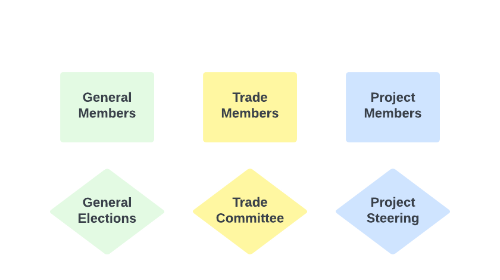

+++
title = "Governance"
linkTitle = "Governance"
[menu.main]
weight = 20
pre = "<i class='fas fa-gavel pr-2'></i>"
+++



  

The Nivenly Foundation’s membership is structured to empower individuals and organizations to actively participate in our mission to foster open source software community and maintainer autonomy, project control, and long-term sustainability. This guide outlines the roles and responsibilities of the three key membership types: General Members, Project Members, and Trade Members, and provides an overview of how governance works within the foundation.



<section id="pageContent">
  

## The Board of Directors

In the early stages of bootstrapping the foundation, the board of directors serves as the main facilitators of due process.
At this time the board of directors will reserve total control of the organization.

Our intention is to delegate out as much control as possible from the board of directors to the member branches as structure and governance process harden over time.

## General Membership

Nivenly believes that communities should have as much control, influence, and authority over our organization as any corporation or sponsor.

We asked ourselves how do we ensure that our community members have the tools and resources needed to influence the organization and impact our decisions?

This is why Nivenly is structured much like a traditional [cooperative or co-op](https://en.wikipedia.org/wiki/Cooperative) and why we have called out a special **General Membership** class which is governed democratically.

### Who is a General Member?

#### Definition 

General Members are individuals who believe in and support the Nivenly Foundation’s overarching mission. They represent the foundation’s community at large and are integral to shaping its direction through participation in governance. General membership is open to any interested individual who agrees to abide by the [Nivenly Covenant](https://nivenly.org/covenant/), and is priced at $7.00 USD/per month.

###### Key Responsibilities

- Governance Participation: General Members have voting rights in key decisions, including electing Board Members and approving changes to foundational documents.
- Community Engagement: General Members participate in discussions, events, and initiatives to promote Nivenly’s mission and values.
- Representation: Act as ambassadors of Nivenly, sharing its values and vision within their own communities.

###### Eligibility

- Open to individuals who align with The Nivenly Foundation’s values of autonomy, project control, and sustainability, and agree to abide by the Nivenly Covenant.
- Membership is accessible through an [application process](https://opencollective.com/nivenly-foundation).

##### Do I need to be a general member to use Nivenly's software and services?

No, you do not need to be a general member to use any of our free services such as [Hachyderm](https://hachyderm.io).

##### How are general elections held?

At any point any member of Nivenly can call for a general election on any topic they chose to suggest.
Elections will be facilitated by Nivenly and the board of directors at their discretion.

Communities have access to diplomacy and process for problem-solving.
We hope to bring balance and reason to "The Mob of Angry Townsfolk" mentality, by giving our communities access to a light weight democratic process.

## Trade Membership

A trade membership is a more expensive sponsorship class reserved for entities such as corporations.
We base the price of membership off the size of the entity which we believe will help us offset the impact.

### Who is a Trade Member?

#### Definition

Trade Members are organizations, businesses, or entities that partner with The Nivenly Foundation to support its initiatives. They provide financial, technical, or operational resources to advance the foundation’s goals while benefiting from collaboration and shared innovation.

###### Key Responsibilities

- Resource Support: Provide funding, tools, or other resources to support Nivenly projects and initiatives.
- Strategic Collaboration: Partner with The Nivenly Foundation to align organizational goals with the foundation’s mission.
- Engagement in Governance: Participate in governance processes to represent their organization’s perspective and help shape the foundation’s strategies.

###### Eligibility
- Open to organizations committed to supporting open collaboration and sustainability.
- Membership is formalized through agreements outlining the partnership’s scope and contributions.

<table>
    <thead>
    <tr>
        <th class="tg-0lax"></th>
        <th class="tg-0lax">Tier 0</th>
        <th class="tg-0lax">Tier 1</th>
        <th class="tg-0lax">Tier 2</th>
        <th class="tg-0lax">Tier 3</th>
        <th class="tg-0lax">Tier 4</th>
    </tr>
    </thead>
    <tbody>
    <tr>
        <td class="tg-0lax">Entity Size</td>
        <td class="tg-0lax">Exempt</td>
        <td class="tg-0lax">0-99</td>
        <td class="tg-0lax">100-499</td>
        <td class="tg-0lax">500-999</td>
        <td class="tg-0lax">1,000</td>
    </tr>
    <tr>
        <td class="tg-0lax">Annual Cost</td>
        <td class="tg-0lax">$0.00</td>
        <td class="tg-0lax">$7,500</td>
        <td class="tg-0lax">$15,000</td>
        <td class="tg-0lax">$30,000</td>
        <td class="tg-0lax">$60,000</td>
    </tr>
    </tbody>
</table>

Nivenly takes a pragmatic and realistic approach to managing our trade memberships.
We understand that a healthy relationship with the industry is critical for success, while we also understand the risk of our community organization turning into a showroom floor.

We believe corporations can find harmony with communities, given the right conditions and structure.

The trade membership committee is tasked with organizational steering while also given controlled access to community spaces, project spending and approval, and our various community resources.

We find the best trade members are members who have a vested interest in the success of key Nivenly projects, services, or communities.

## Project Membership

### Who is a Project Member?

#### Definition 

Project Members are contributors actively involved in one or more of The Nivenly Foundation’s open-source projects or initiatives. They play a hands-on role in driving the success of specific projects through their expertise and contributions.

###### Key Responsibilities

- Active Contribution: Collaborate on tasks such as development, design, documentation, or community management for Nivenly projects.
- Decision-Making: Participate in project-level governance, including technical decisions and roadmap planning.
- Knowledge Sharing: Share expertise and mentor new contributors within their projects.

###### Eligibility

- Open to individuals with relevant skills or expertise who wish to contribute to specific projects.
- Membership is typically established through ongoing contributions or by joining project teams via established pathways.

The Nivenly foundation exists to support open source projects.

As projects are brought to the foundation, each project is given an opportunity to appoint a set of delegates.

The project delegates are given a seat in the same senate as the trade members in exchange for their continued work on their respective projects.
The only path to a project delegate seat is by contributing to a Nivenly project. Project seats cannot be purchased.

Projects operate autonomously and are able to elect their delegates as they chose.
Delegate seats are approved by the board of directors to roughly match the number of trade sponsors the organization takes on.

The Nivenly trade committee and project steering groups are tasked with accepting and approving new projects for the organization.

If you are interested in discussing a potential future project please email [info@nivenly.org](mailto:info@nivenly.org)

## Governance at The Nivenly Foundation

### Why Governance is Set Up this Way

The Nivenly Foundation’s governance structure ensures that all members—individuals and organizations—have a voice in the foundation’s direction. This participatory approach reflects our values of transparency and inclusivity while providing a framework for accountability. Governance is designed to grow and adapt as The Nivenly Foundation evolves, ensuring that it remains flexible and effective.

### How Governance Works While We’re Growing

As Nivenly is still building out its governance chambers, processes are iterative and involve:

- Interim Committees: Temporary groups making operational decisions while permanent governance bodies are established.
- Community Input: Open forums and discussions where members can voice ideas and concerns.
- Gradual Implementation: Rolling out governance mechanisms incrementally to ensure sustainability and inclusivity.

### How and When to Participate in Governance

- Regular Meetings: Attend quarterly governance meetings to stay informed and contribute to decision-making.
- Project Governance: Participate in decisions specific to projects you’re involved in.
- Elections and Voting: Take part in scheduled elections to select board members or approve key proposals.
- Discussion Channels: Join The Nivenly Foundation’s Discord channels dedicated to governance topics.

### Voting for a Project to Join the Foundation

When members vote on whether a project should become part of The Nivenly Foundation, they consider:

- Alignment with Mission: Does the project align with The Nivenly Foundation’s values and goals?
- Community Support: Is there sufficient interest and support from members?
- Sustainability: Does the project have the potential for long-term impact and viability?
- A “yes” vote implies that members see the project as a meaningful addition to the foundation’s portfolio, while a “no” vote suggests further discussion or adjustments may be needed.

### Other Governance Decisions and Voting

Members may also vote on:

- Policy Changes: Updates to bylaws, membership rules, or foundational documents.
- Budget Approvals: Allocation of resources to projects or initiatives.
- Elections: Selection of board members or other leadership roles.

Discussions are preferred for:

- Brainstorming new initiatives or policies.
- Resolving disputes or addressing concerns informally.
- Elections and formal votes are held when decisions require clear consensus or binding resolutions.

### Summary of Membership Types and Governance

<table>
    <thead>
    <tr>
        <th class="tg-0lax">Membership Type</th>
        <th class="tg-0lax">Who They Are</th>
        <th class="tg-0lax">Key Responsibilities</th>
        <th class="tg-01ax">Eligibility</th>
    </tr>
    </thead>
    <tbody>
    <tr>
        <td class="tg-0lax">General Member</td>
        <td class="tg-0lax">Individuals supporting The Nivenly Foundation’s mission</td>
        <td class="tg-0lax">Participate in governance and community engagement</td>
        <td class="tg-0lax">Open to individuals aligned with Nivenly Foundation values</td>
    </tr>
        <tr>
        <td class="tg-0lax">Project Member</td>
        <td class="tg-0lax">Contributors to Nivenly Foundation projects</td>
        <td class="tg-0lax">Actively contribute to and make decisions on projects</td>
        <td class="tg-0lax">Open to skilled individuals actively contributing</td>
    </tr>
    <tr>
        <td class="tg-0lax">Trade Member</td>
        <td class="tg-0lax">Organizations partnering with Nivenly Foundation</td>
        <td class="tg-0lax">Provide resources and collaborate strategically</td>
        <td class="tg-0lax">Open to aligned organizations</td>
    </tr>
    </tbody>
</table>

Governance ensures every member has a voice and that The Nivenly Foundation’s mission is achieved collaboratively. We encourage all members to actively participate and help shape the foundation’s future.

  

</section>