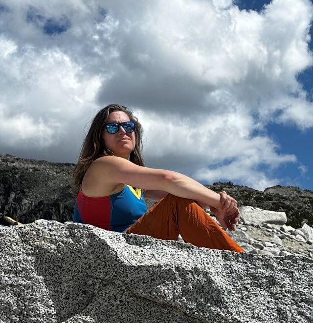

Please add your contribution below via a [pull request](https://github.com/nivenly/website/) or <a href="mailto:info@nivenly.org?subject=Kris Nóva Memorial">email us directly at  with Kris Nóva Memorial in the subject</a>.

## Obituary and Tribute Book

> Kris Nóva, of Seattle, Washington, passed away on Wednesday, August, 16, 2023, while climbing.
> 
> Nóva was an author, engineer, computer scientist, and alpinist best known for her work on Linux, Kubernetes, and Aurae.
> 

## Other memorials, etc...

### Arjun Bery
Nóva served as a tremendous source of inspiration not only to me but also to countless others. Her multifaceted talents spanned engineering, writing, and education, but what truly set her apart was her profound kindness, compassion, and generosity.

My initial encounter with Nóva occurred in November 2022 when I was introduced to a new Mastodon instance, [Hachyderm](https://hachyderm.io), which emphasized a tech-oriented focus and, most importantly, fostered a safe and supportive community. Intrigued, I created a new account to delve into this instance. Instantly, I found myself excited by the community that Nóva's presence helped build. Her warmth and inclusivity were refreshing, as she readily shared her time and expertise with everyone she encountered.

As Hachyderm flourished, I had the privilege of stepping into a volunteer role within both the community and Nóva's personal Twitch stream. This afforded me the chance to get to know her and to gain invaluable insights from her vast reservoir of knowledge. I will always cherish the memories of the "real-time" advice she was willing to provide myself and others, which ranged from technical to personal. I will always be grateful for the positive impact she had on my life.

Nóva's legacy will forever be etched in my memory, characterized by her boundless compassion, boundless generosity, and unwavering dedication to assisting others. I will always be grateful to her for the way that she helped to change my life for the better. She will be missed.

I leave everyone with [a link to the moment that Nóva got Aurae to spawn on Twitch.](https://www.twitch.tv/krisnova/clip/PoisedBreakableDiscSMOrc-_QCFBGYAmFzN7_yg)
